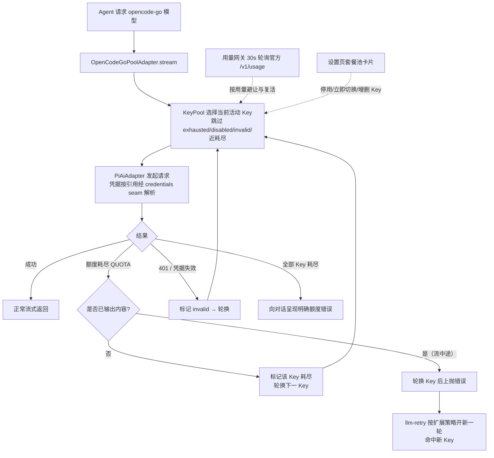

# dsh-opencode-go-pool

DeepSeek Harness（DSH）插件：**OpenCode Go 套餐的多 Key 池** —— 当前 Key 额度耗尽时**自动、无感地切换到下一个 Key**，并在设置页提供与官网一致的**套餐余额管理卡片**（5 小时滚动 / 每周 / 每月 已用·剩余·重置时间）。

- 每个 OpenCode Go 账号有独立的 5 小时滚动 + 每周 + 每月额度。DSH 官方供应商（`dsh-llm-pi-ai` 的 `opencode-go` 路由）每个供应商只能填一个 Key，额度耗尽后必须手动更换——本插件接管该路由，用 Key 池 + 自动故障切换解决。
- 余额数据来自 OpenCode 官方用量接口（与官网同源，见下文）。
- **运行环境**：DSH `0.2.1-alpha.1`（`peerDependencies` 锁定该系列；0.1.x 的设置 seam 仍兼容，但新特性以 0.2.1 的 volatile 配置为准）。

## 功能

| 功能 | 说明 |
|---|---|
| 🔄 自动切换 Key | 请求因额度耗尽（`QUOTA`）失败时，在同一次流式调用内静默换下一个 Key 重发，对话零感知；凭据失效（401/`INVALID_CREDENTIAL`）同样自动跳过 |
| 📊 套餐管理卡片 | 设置侧边栏「OpenCode Go 套餐池」页：每个 Key 的 5h 滚动 / 每周 / 每月 已用%·剩余%·重置倒计时，与官网一致 |
| 🎛 运行态管理 | 卡片内：立即切换、停用/启用、清除失效、新增/删除 Key（写入插件命名空间，带版本栅栏，无需改 yml） |
| ♻️ 自动复活 | 额度耗尽的 Key 在其 5h 窗口重置后（用量接口报告恢复）自动回到池中 |
| 🧭 无缝接管 | 接管 `opencode-go` 路由：删除「设置 → 模型」中的 opencode-go 行后自动完成，历史会话与模型选择器完全不变 |
| 🗂 模型选择 | 卡片内勾选该路由暴露哪些模型：「全部模型」跟随官方目录；自定义时未勾选的模型不出现在聊天模型下拉、也无法发起请求；默认折叠，点「展开」查看 |
| 📥 拉取最新模型 | 卡片内「拉取模型」从官方 `models` 接口抓取供应商最新模型列表；目录里还没有的新模型即时进入可选列表（按默认协议接入，勾选即可尝试） |
| 📈 输入框额度胶囊 | 输入框内、模型选择器**左侧**的常驻胶囊：当前会话用的正是本池路由时，直接显示服务中账户的「5h x% · wk y% · mo z%」并随用量阈值从灰阶升到琥珀 / 红；点开弹层看三个窗口的完整名称、重置倒计时、账户名与手动刷新；切到别的供应商即刻隐藏，也不产生任何额度流量 |

## 安装

```sh
dsh plugin --profile web add github:gaodayihao/dsh-opencode-go-pool
```

纯 ESM、零构建步骤，没有 `prepare`/`build` 脚本，所以 GitHub 直装就是仓库里的文件本身：装完重启 DSH 一次即可（host 半与浏览器 bundle 都在启动时加载）。

装好后：

1. **迁移**：打开「设置 → 模型」，删除 `opencode-go` 供应商行（本插件会自动接管该路由；未删除时插件保持休眠，页面标题右侧的徽标会显示「等待接管」并给出引导）。
2. **添加账户**：打开「设置 → OpenCode Go 套餐池」→「账户」→「添加账户」，填一个显示名（如 `主号`）并粘贴密钥，点「应用」。密钥直接写入 DSH 凭据服务（引用名自动生成为 `OPENCODE_GO_KEY_<ID>`），**不会进入任何设置文档、日志或 RPC 响应**。账户的增删改都是**即时落地**的。
3. **其余配置**（切号策略、模型选择、侧边栏开关、高级设置）改动后会从页面底部滑出浮动保存条，点「保存」一次性提交；不想留就点「放弃修改」。

### 手工安装（等价步骤）

`$DSH_HOME/profiles/web/cordis.patch.yml` 加入插件行：

```yaml
- id: opencode-go-pool
  name: 'dsh-opencode-go-pool'
  config:
    route: opencode-go          # 接管官方路由；冲突时休眠等待接管
    keys: []                    # 初始为空，由卡片管理（也可在此预置）
    preemptAtPercent: 100       # <100 时，5h/每周用量达到即主动避让（默认 100：失败才切）
    switchAfterConsecutiveFailures: 0
    modelMode: all              # all=暴露全部官方模型；custom=仅暴露 models 列出的模型
    models: []                  # modelMode=custom 时的模型 id 列表（也可在卡片内勾选）
    requestTimeoutMs: 300000    # 请求超时（等待首个字节），写入 pi-ai 的 timeoutMs
    streamIdleTimeoutMs: 300000 # 流空闲超时，由适配器的 idleWatchdog 执行
    transportMaxRetries: 5      # 网络失败（TRANSPORT）每次模型请求的重试预算
    showSidebarQuota: false     # 侧边栏额度卡片开关
    showComposerQuota: true     # 输入框额度胶囊开关
    usageBaseUrl: https://opencode.ai/zen/go/v1/usage
    usageRefreshMs: 30000
    timeoutMs: 15000            # 用量/模型接口的请求超时
```

`keys` 之外的所有字段都可以留空（走默认值）；上面这份就是插件自带 bundle patch 的内容。并在 profile 的 `package.json` 中声明依赖后重新安装依赖。

## 工作原理



- **静默切换发生在同一次 `stream()` 内**：额度错误在产出任何 token 前到达时，直接换 Key 重发，上层（agent loop）看到的是一次成功的流式回复。
- **流中途限额**（已吐 token 后 429）无法静默重试；此时先轮换 Key 再上抛，插件同时把 `QUOTA` 加入该路由的可重试码（预算 = Key 数），`dsh-llm-retry` 会自动开新一轮命中新 Key。
- **路由接管**：`opencode-go` 路由被 `dsh-llm-pi-ai` 持有时，插件休眠并监听 `llm/adapters-updated`，路由一释放即原子接管；老会话记录的路由 id 不变，历史对话无缝继续。
- **凭据**：配置只存凭据引用名（`apiKeyEnv`），明文走 DSH 凭据 seam，每次请求按引用解析；解析失败大声报 `MISSING_CREDENTIAL`，绝不回落到无关的环境变量 Key。
- **模型选择**：卡片勾选后写入 `modelMode`/`models`；适配器的 `listModels` 只返回勾选的模型（聊天模型下拉即时生效），`resolveModel`/`stream` 对未勾选模型返回明确的 `UNKNOWN_MODEL`。选择变化会重发 `llm/adapters-updated`，模型选择器无需重启即可刷新。
- **设置写入**：卡片经 Typert RPC 调 `putKeys`/`putConfig`，host 侧走 DSH 0.2.1 的 `ctx.settings.update(entryId, patch, revision)`（config-editor 支撑的 SettingsForms）；插件 Config 中卡片可编辑的字段声明为 `volatile`，Loader 原地更新并广播 `loader/volatile-update`，插件据此重算 KeyPool / 路由，插件实例不重挂。`route` 保持普通字段：改路由会重挂插件并重新注册适配器。
- **适配器画像与 auth**：接管模式直接向 `dsh-llm-pi-ai` 提供该路由的*已解析* profile（`piProvider`、`modelErrors`、`configuredMaxTokens`、图像预算等适配器自有字段）。这些字段平时由 llm-pi-ai 的 `Config` 解析产生，插件自建时必须齐备：`PiAiAdapter.modelOf()` 先读 `profile.modelErrors`，缺这个 Map 时每个模型的解析与流式请求都会抛 `Cannot read properties of undefined (reading 'get')`。0.2.1 还把适配器的 `auth`（`{credentials, authContext}`）从可选改为必填，插件提供 `createPiAiAuth()`：不写 pi-ai 凭据记录（Key 一律用 `apiKeyEnv` 引用），只把环境/API 引用解析交给 credentials seam。回归测试见 `test/profile.test.mjs` 与 `test/settings-forms.test.mjs`。
- **持久化**：运行态（活动 Key / 耗尽 / 失效 / 停用）原子写入 `$DSH_HOME/opencode-go-pool.state.json`，重启恢复。

## 用量接口

```http
GET https://opencode.ai/zen/go/v1/usage
Authorization: Bearer <OpenCode Go API Key>
```

返回三个窗口的 `percent`（0–100）与 `resetsAt`（ISO-8601）：

```json
{ "usage": { "rolling": {"status":"ok","percent":9, "resetsAt":"…"},
             "weekly":  {"status":"ok","percent":12,"resetsAt":"…"},
             "monthly": {"status":"ok","percent":6, "resetsAt":"…"} } }
```

该接口**未写入 OpenCode 公开文档**，解析做了防御式处理：形状变动只影响卡片显示（降级为错误提示），不影响自动切换功能；`usageBaseUrl` 可配置。

## 配置项

| 键 | 默认 | 含义 |
|---|---|---|
| `route` | `opencode-go` | 接管官方路由；改为 `opencode-go-pool` 时注册自有路由（与官方并存，模型选择器需手动切换一次） |
| `keys` | `[]` | Key 列表：`{id, label, apiKeyEnv}`；通常留空由卡片管理 |
| `preemptAtPercent` | `100` | 5h 滚动用量达到该百分比即主动避让；100 = 仅在失败时切换 |
| `switchAfterConsecutiveFailures` | `0` | 同一 Key 连续失败 N 次后切号；0 = 关闭 |
| `modelMode` | `all` | `all`=暴露官方目录全部模型（新模型自动可用）；`custom`=仅暴露 `models` 勾选的模型 |
| `models` | `[]` | `modelMode=custom` 时的模型 id 列表；卡片内「模型」模块勾选后写入 |
| `requestTimeoutMs` | `300000` | **请求超时**：等待响应首字节的超时，直接写入 pi-ai 的 `timeoutMs`（「高级设置」可改，1–3600 秒） |
| `streamIdleTimeoutMs` | `300000` | **流空闲超时**：生成流停滞多久视为死连接，写入 profile 的 `streamIdleTimeoutMs`，由适配器的 `idleWatchdog` 执行（「高级设置」可改，1–3600 秒） |
| `transportMaxRetries` | `5` | **网络失败重试次数**：连接类失败（`TRANSPORT`）每次模型请求的重试预算，0–50（「高级设置」可改） |
| `showSidebarQuota` | `false` | 在侧边栏底部显示额度卡片；关闭时不发起任何额度查询（「集成与显示」可改） |
| `showComposerQuota` | `true` | 在输入框内、模型选择器左侧显示额度胶囊；**默认开启**（它只在会话使用本池路由时出现，不会为其他供应商产生流量），关闭后同样不做任何额度查询（「集成与显示」可改） |
| `usageBaseUrl` | `https://opencode.ai/zen/go/v1/usage` | 用量接口地址 |
| `modelsBaseUrl` | `https://opencode.ai/zen/go/v1/models` | 「拉取模型」接口地址 |
| `usageRefreshMs` | `30000` | 卡片轮询间隔（host 侧另有 15s TTL 缓存） |
| `timeoutMs` | `15000` | 用量/模型接口的请求超时（与模型请求的 `requestTimeoutMs` 无关） |

## 界面

设置页标题为「OpenCode Go 套餐池」，侧边栏导航项则为短名「OpenCode Go」（导航栏窄，长名会被截断），并带一枚与同级项同语言的小标记。页面按模块分组（组间一条细分隔线 + 小标题），自上而下：

1. **标题行**：左侧标题与副标题，最右侧一枚接管状态徽标 —— **已接管为绿色**，自有路由 / 等待接管为橙色。等待接管时下方保留一段可操作的提示（告诉你删掉「设置 → 模型」里的 opencode-go 行），其余情况不再占版面；
2. **账户**：组头右侧是刷新按钮与「更新于 时间」（同一行、居中对齐）。每个凭据一张瘦身卡片 —— 一行标题（状态圆点 · 名称 · 徽章 · 展开箭头）+ 一行紧凑额度条，**左上角的「⋯」菜单**承担全部操作（设为当前使用 / 编辑凭据 / 重命名 / 停用·启用 / 清除失效 / 删除）。编辑凭据就是卡片内联表单，密钥只走凭据服务。卡片下方是「添加账户」、切号策略与最近一次切号；
3. **模型**：模型范围（全部 / 自定义）+ 拉取模型 + 可勾选清单；
4. **集成与显示**：两个开关 —— 侧边栏额度卡片（默认关）与输入框额度胶囊（默认开）；
5. **高级设置**（默认收起）：请求超时 / 流空闲超时 / 网络失败重试次数。

侧边栏额度卡片打开的是一个居中列的额度面板，逐账户显示三条额度条与重置倒计时。

### 输入框额度胶囊

输入框工具行的最右侧、**模型选择器左边**还有一枚胶囊（DSH 的 `conversation.input.right` 槽位渲染在 `conversation.input.model` 之前，所以它天然落在模型左侧）。它挂在同一个数据层上，不是第二套轮询：

- **有开关**：「集成与显示 → 在输入框显示额度胶囊」（配置项 `showComposerQuota`）**默认开启**。它跟侧边栏卡片默认相反是有意的：胶囊只在会话用本池路由时才存在，不会为别的供应商产生任何流量；真不想要，关掉即可 —— 关闭后连状态探测都不做，等于这个界面不存在。
- **始终跟当前使用账户**：读数取自 host 标了 `active` 的那一行（来自运行中的 `pool.activeId`），而不是第一条。所以在卡片里「设为当前使用」换号、或额度耗尽自动轮换之后，胶囊显示的就是正在服务的那个账户；一次回合结束后会立刻重新读一次池状态，所以自动轮换不必等到下一次轮询（`usageRefreshMs`）才纠正。
- **只在用本池路由时出现**：可见性由会话实时的模型选择投影（`modelSelection`）决定 —— 供应商是本插件的路由（默认 `opencode-go`，自有路由模式为 `opencode-go-pool`，或你在配置里改名后的路由）时显示，切到任何别的供应商同一帧就隐藏。
- **显示服务中账户的用量**：胶囊内即「5h 9% · wk 12% · mo 6%」（5 小时滚动 / 每周 / 每月），并按用量分级换色：50% 起琥珀、80% 转红、90% 起加粗红，被限流的窗口直接按最高级显示。
- **点开看详情**：弹层在胶囊正上方展开，逐窗口给出完整名称、百分比与「剩余 4h 30m」式倒计时，底部是账户名、**刷新**与数据时间；点胶囊外任意处或按 Esc 收起。
- **数据还没有时说实话**：首次查询在途显示「查询中…」，池里没有账户显示「用量不可用」，某个 Key 查失败则显示 `<err:unauthorized>` 之类的编码，点开弹层看到人话解释并可就地刷新。
- **不做的事**：胶囊没有自己的一套轮询 —— 它复用池自身的刷新间隔（`usageRefreshMs`），关闭开关或切走路由时不留下任何后台请求。弹层**没有金额行**：本插件调的 `/zen/go/v1/usage` 只返回 `status` / `percent` / `resetsAt`，不返回金额，所以不编造 `$used / $limit` 或余额。

### 保存：账户即时落地，配置走浮动保存条

页面上**没有**逐模块的保存按钮。**账户的一切改动（新增 / 改名 / 换密钥 / 停用 / 清除失效 / 删除）立即写入**；只有配置类改动（切号策略、模型选择、侧边栏开关、三个网络设置）会进入草稿，此时页面底部滑出一条浮动保存条，提示「有未保存的更改」并提供 **放弃修改 / 保存** 两个动作；数值非法时保存条转为错误色并提示违规，保存按钮不生效。保存成功后保存条变为绿色「已保存」并自动淡出。

### 首屏为什么不再卡在「查询中…」

设置的读取被拆成两个 RPC：`status` 只读 host 内存里的池状态与**上一次**查到的用量，永不发起网络请求；`usage` 才逐 Key 查询官方接口。页面因此立刻成形，各账户卡片在数值回来前显示自己的「查询中…」，而不是整页等待。`status` 保持**无副作用**（不查询、也不触发查询），所以侧边栏额度卡片关闭时可以零流量地读取自己的开关状态。

## 与其他插件的关系

- 本插件覆盖 [dsh-opencode-go-usage](https://github.com/xiaoqi20/dsh-opencode-go-usage) 的全部功能（多 Key 版），安装后可卸载后者。
- 与 `dsh-llm-pi-ai` 共存：接管模式下请删除其 `opencode-go` 行；pi-ai 的其他供应商不受影响。

## 开发

纯 ESM，零构建步骤：

- Host 半：`index.js`（插件 + 池适配器 + 接管）、`pool.js`（状态机）、`usage.js`（用量网关）、`models.js`（模型目录拉取）、`transport.js`（网络失败重试预算）、`typert.host.js`（RPC 清单）
- 浏览器半：`client.js`（lazy-CJS bundle，`window.__ModuleLoader__.load` 格式）
- 测试：`node --test test/*.test.mjs`（132 项，依赖装齐后 0 跳过）：状态机 17（`pool`）、用量网关 7（`usage`）、模型目录 8（`models`）、网络重试预算 6（`transport`）、cordis 烟测 27（`smoke`：路由接管、静默切换、0.2.1 forms seam、0.1.x register/configEditor 旧 seam、status/usage 拆分、断流分类、高级设置、真实 profile 配置启动、strict wire 契约）、真实服务集成 9（`integration`）、真实 SettingsForms 3（`settings-forms`）、适配器画像与 auth 6（`profile`：含思考控制规整 2 项）、包清单 3（`package`）、导入与 Typert 清单 6 + 1（`current-dsh-import` / `typert-manifest`；前者的「真实子进程导入」一项需要能 `spawn` 的环境）、客户端 bundle 执行与渲染 39（`client`：四个槽位注册、模块分组的四条小标题与三条分隔线、「⋯」位置与顺序、收起态瘦身、侧边栏卡片门控、额度面板与标题行的对齐、store 两段式加载与轮询生命周期、输入框胶囊的开关门控 / 路由门控 / 跟当前账户 / 严重度配色 / 弹层与空态）。缺少 harness 依赖时相关测试优雅跳过。

```sh
node --test test/*.test.mjs
```

## 注意事项

- **多账号使用请自行确认符合 OpenCode 服务条款**；本插件只提供技术能力。
- 全池耗尽时对话会收到明确的额度错误，卡片会全红显示；5h 窗口重置后自动恢复。
- 每 Key 每次静默重试会重复计费输入 token（额度失败本身不计费），成本上限 = 池大小 × 单请求。

## 许可证

MIT

## 验证记录

**2026-10-09 标题不再提炼，只抄第一条消息**：`node --test --test-isolation=none test/*.test.mjs`（进程内运行）→ 132 项，131 通过、0 跳过；唯一失败仍是 `current-dsh-import.test.mjs` 里需要 `spawn` 子进程的那一项（沙箱禁止捕获子进程输出；插件入口的实际导入由 `test/profile.test.mjs` 就地覆盖）。

- **症状**：新会话的标题不再是模型提炼出的关键信息，而是第一条消息开头几个字（DSH 的兜底标题），且只在本池路由上出现。
- **定位**：会话日志里每次都有 `session/title-llm-request`（`route=opencode-go/deepseek-v4.1-flash`、`maxTokens=64`），但之后没有 `source: provider` 的 `session/title` —— 辅助调用发出去了、没有结果。pi-ai 的 `openai-completions` 只在 `model.thinkingLevelMap.off !== null` 时才发 `thinking: { type: 'disabled' }`（`dist/api/openai-completions.js:666-677`），而目录里 `deepseek-v4.1-flash` 声明的正是 `off: null`，于是「不带 reasoning effort 的请求」一个思考控制都不带，网关按默认（思考开）推理。Harness 的标题调用恰好是这种形状：官方 DeepSeek 适配器会把 `purpose: 'session-title'` 映射成关思考，所以宿主只给 64 token。
- **网关实测**（2026-10-09，`deepseek-v4.1-flash`、`max_tokens: 64`）：不带思考控制 → `finish=length`、正文 0 字、`reasoning_tokens=64`；同一请求加 `thinking: { type: 'disabled' }` → `finish=stop`、正文 44 字、23 output tokens、0 reasoning tokens。
- **修法**：`buildProfile().getModels()` 对 `thinkingFormat: 'deepseek'` 的模型去掉这个 null `off`（新增 `withExplicitThinkingOff`），让「没指定 effort」的请求带上 disabled —— 与同路由的 `deepseek-v4-flash` / `deepseek-v4-pro` / `kimi-k2.6`（本来就没有 `off` 键）一致；模型选择器同时恢复出真正可用的「Off」档。其他厂商的 `off: null`（glm / kimi-k3 / qwen / grok…，`thinkingFormat` 不同）保持原义。
- **实测 wire body**（注入假 `fetch` 跑真实 SDK，未联网）：原描述符 + 无 effort → 无 `thinking`；规整后 + 无 effort → `thinking:{type:'disabled'}`；规整后 + 显式 high（主对话）→ `thinking:{type:'enabled'}` + `reasoning_effort:'high'`（不受影响）；规整后 + 选「Off」→ `thinking:{type:'disabled'}`。
- **测试**：`test/profile.test.mjs` 新增 2 项（4 → 6）—— 一项钉住规整本身（去掉 null `off`、其他 `thinkingFormat` 不动、不修改传入描述符），一项用 pi-ai 的 `getSupportedThinkingLevels` 断言「Off」档由隐藏变为可选，并遍历真实目录断言所有 deepseek 格式模型都不再带 null `off`。

**2026-10-09 额度面板标题行对齐**：`node test/*.test.mjs`（逐个文件、进程内运行）→ 130 项，129 通过、0 跳过；唯一失败仍是 `current-dsh-import` 里需要 `spawn` 子进程的那一项。本轮改动与对应测试：

- **症状**：侧边栏卡片打开的额度面板，右上角「更新于 12:12:29 / 刷新 / ×」里时间明显高出按钮一截。
- **原因**：`.ogp-header` 用 `align-items:flex-start`（标题块是两行，必须顶对齐），于是它每个子项都按顶边对齐。按钮自带 `height:28px` 并把文字在自己盒子里居中，而时间是一个 `line-height:18px` 的裸 `span`，只有 18px 高 —— 两者顶边对齐后，时间的文字中心在 9px、按钮的在 14px，差了 5px。账户组的组头早就用一个 `span.ogp-groupAction`（`display:inline-flex; align-items:center`）把「刷新 + 时间」包成一行，面板标题行漏了这一步。
- **修法**：把时间、刷新、× 三者也包进同一个 `ogp-groupAction`（复用既有类，不新增样式）。现在 18px 的时间行被居中到 28px 的行高里，两者文字中心都落在 14px。
- **测试**：`test/client.test.mjs` 新增 1 项（39）—— 断言三者同在那一个 `ogp-groupAction` 里且顺序为「时间 → 刷新 → 关闭」，并断言标题行下不再有裸的 `.ogp-meta`；为此给测试的 `stubStore` 加了状态覆盖参数，好把 `loadedAt` 喂成非空。

**2026-10-09 输入框胶囊的开关与跟号**：`node test/*.test.mjs`（逐个文件、进程内运行）→ 129 项，128 通过、0 跳过；唯一失败仍是 `current-dsh-import.test.mjs` 里「用真实子进程导入插件入口」那一项（沙箱禁止捕获子进程输出，其等价检查已单独执行通过）。

- **新增开关 `showComposerQuota`（默认开）**：与 `showSidebarQuota` 走同一条链路 —— Config 的 volatile 布尔字段、`FALLBACK_CONFIG`、`status()` 回传、`putConfig` 的类型校验与补丁、typert 的 `PoolStatus` / `PoolConfigPatch` 契约、bundle patch 默认值，以及「集成与显示」里的第二个开关行（两行由一个内联 `toggle()` 生成，避免复制粘贴走样）。默认开而侧边栏那个默认关是有意的：胶囊只在会话用本池路由时存在，不会给别的供应商带来流量。
- **关掉即静默**：胶囊只在开关为真时才 `retain()` 那趟共享轮询；开关未知（旧 Host 没有这个字段）按关处理 —— 半个更新的组合宁可什么都不显示，也不显示一个用户关不掉的东西。为此加了一次 `probeOnce()`（纯内存、零网络的 `status` 读）来先问开关，且只在会话已经跑在本池路由上时才问。
- **跟当前使用账户**：读数取自 `keys[].active`（host 侧 `pool.activeId`）而不是第一条；另加一个「回合结束就重读池状态」的触发器 —— 一次回合正是池会自己换号的时刻（Key 中途耗尽），所以自动轮换不必等下一次 `usageRefreshMs` 才纠正；没有 `active` 标记时回落第一条，保证仍有话说。
- **测试**：`test/client.test.mjs` 由 35 增至 38 —— 开关门控与「旧 Host 读作关」、跟号（`active` 搬家后数值与账户名同步替换、无 active 时回落第一条）、会话套件的两个 hook 缺一即隐藏、以及「集成与显示」恰好两个开关且各自读自己的草稿字段；`test/settings-forms.test.mjs` 的 volatile 字段集合与默认值、`test/smoke.test.mjs` 的默认值 / `putConfig` / 非布尔拒绝 / bundle patch 字段清单同步更新。

**2026-10-09 输入框额度胶囊**：`node test/*.test.mjs`（逐个文件、进程内运行）→ 126 项，125 通过、0 跳过；唯一失败是 `current-dsh-import.test.mjs` 里「用真实子进程导入插件入口」那一项（`spawnSync` 的 `status` 为 `null`），属本机沙箱禁止捕获子进程输出所致 —— 该断言的等价检查已单独执行：`import('./index.js')` 正常返回 `Config` / `OpenCodeGoPool` / `buildProfile` / `createPiAiAuth` / `createSettingsScope`。本轮改动与对应测试：

- **新增第 4 个槽位**：`client.js` 注册 `conversation.input.right`（id `opencode-go-pool-chip`，`order` 110，复用页面字典）—— DSH 的 `InputBar` 先渲染该槽位、再渲染 `conversation.input.model`，所以胶囊落在模型选择器左侧。端到端搬运参考插件 [dsh-opencode-go-usage](https://github.com/xiaoqi20/dsh-opencode-go-usage) 的显示方式：同一枚 OpenCode Go 图标（内联双色 SVG，跟随 `body[data-ds-dark-theme]` 切换）、同样的「5h / wk / mo」内联分段与 50/60/70/80/90 分级配色、同样的向上弹层与点外部 / Esc 收起。
- **用它自己的机制，不搬配置**：数据来自同一个 `createPoolStore`（`status` + `usage` 两个 RPC）与同一个 `usageRefreshMs` 轮询，可见性来自会话投影 `modelSelection`，所以胶囊没有 cookie / workspace 之类的任何配置项。
- **金额行按实际情况去掉**：直连官方接口核对过（`GET https://opencode.ai/zen/go/v1/usage` 实测返回 `{"usage":{"rolling":{"status":"ok","percent":11,"resetsAt":"…"},"weekly":…,"monthly":…}}`），只有 `status` / `percent` / `resetsAt`，没有任何金额字段，因此弹层不显示 `$used / $limit` 与余额行。
- **测试**：`test/client.test.mjs` 新增 7 项 —— 槽位注册与「无需 layout 服务」、可见性门控（本池两个路由 + 自定义路由显示，其他供应商 / 空选择 / 无 session kit 一律渲染空）、服务中账户的读数与配色分级、无数据三态（查询中 / 未配置 / `<err:code>`）、弹层逐窗口名称百分比倒计时与刷新、空态与失败态的人话解释、以及纯函数（`formatDuration` / `remainingSec` / `hasReset` / `chipSeverity` / `chipPercentText` / `providerOfSelection` / `isPoolProvider`）的边界。

**2026-10-09 界面与网络设置改版**：`node --test --test-isolation=none test/*.test.mjs` → 101 项通过、0 跳过（第 102 项 `current-dsh-import` 在本机沙箱下无法 `spawn` 子进程，属环境限制）。本轮改动与对应测试：

- **首屏不再卡住**：`status` 拆成纯内存读取，新增 `usage` RPC 负责逐 Key 查询；`test/smoke.test.mjs` 用计数 fetch 证明 `status()` 零请求、`usage()` 每 Key 一次、并发调用共享一趟，并断言上一次结果会落到内存。
- **高级设置真实生效**：`requestTimeoutMs`/`streamIdleTimeoutMs` 写进 `buildProfile`（`test/profile.test.mjs` 断言它们落在 `profile.timeoutMs` / `profile.streamIdleTimeoutMs`）；`transportMaxRetries` 由 `transport.js` 的每次请求预算执行，并已从路由 `retryableCodes` 中移除 `TRANSPORT`，`test/smoke.test.mjs` 走真实 cordis waterfall 验证「重试 N 次后抛出诊断」「新 step 重置预算」「取消的回合不消耗预算」「非本插件路由不干预」。
- **断流可恢复**：适配器在内层流没有结束事件时不再静默返回，而是产出可重试的 `EMPTY_RESPONSE`（未吐内容）或 `STREAM_CLOSED`（已吐内容），两者都在路由白名单内 —— 断线会自动重发该 step，而不是整轮失败。
- **界面**：`test/client.test.mjs` 实际执行 bundle 并渲染，断言四个槽位（`settings.section` / `main` / `sidebar.footer.action` / `conversation.input.right`）注册、四个模块小标题与三条分隔线、「⋯」按钮位于卡片左上角且在名称之前、收起态只有紧凑额度条、侧边栏卡片在开关关闭或状态未知时渲染空、额度面板逐账户三窗口。

**0.2.1-alpha.1 升级验证（2026-10-08）**：`node --test test/*.test.mjs` → 75 项全部通过、0 跳过，跑在 registry 安装的 `0.2.1-alpha.1` 依赖上（`@deepseek-ai/cordis@4.0.5-alpha.1`、`schemastery@3.18.5-alpha.1`、`@earendil-works/pi-ai@0.87.1`）。其中：

- `test/settings-forms.test.mjs` 用**真实** `@deepseek-ai/dsh-settings`（SettingsForms）核对：插件 `Config` 暴露为可编辑表单的字段恰为卡片可编辑的 9 个 volatile 字段，`route` 保持普通字段并被服务拒绝写入；`settings.update(entryId, patch, revision)` 的合并结果、revision 栅栏（`SETTINGS_CONFLICT`）都符合预期。
- `test/integration.test.mjs` 用**真实** `LlmRuntime` 与 `PiAiAdapter`：注册表 / `llm.stream` 全链路 / 接管握手。
- `test/profile.test.mjs` 用**真实** `PiAiAdapter` 校验手写 profile 与新增的 `auth` 注入。

**无 GUI 真实启动验证**（在有可用运行时的机器上执行；本仓库的开发沙箱里 `node-addon-require-builtin` 无法挂接该 Node 构建的 ESM loader，报 `Unsupported/no-getter`，故无法在此复现）：

```sh
DSH_HOME=/tmp/dsh-boot-test/home \
OPENCODE_GO_KEY_A=sk-test-placeholder-aaaa OPENCODE_GO_KEY_B=sk-test-placeholder-bbbb \
node $DSH_APP/node_modules/@deepseek-ai/dsh/lib/bin.js --profile test "ping"
```

预期输出（证明 agent 请求真实派发进池适配器并完成轮换）：

```
dsh: QUOTA: opencode-go-pool: every key is exhausted, disabled, or invalid …
```

状态文件同时记录：两个 Key 因真实 401（`AuthError: Invalid API key.`）被标记 `invalid`、依次轮换、`lastSwitch.reason: invalid`。真实凭据下额度耗尽（`QUOTA`）走完全相同的轮换机器。
